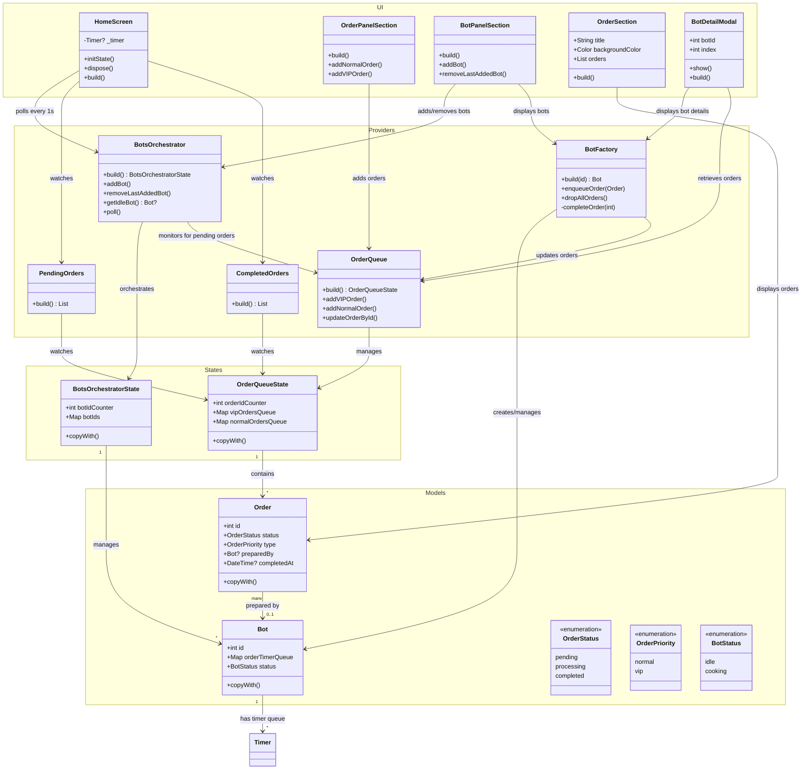

- [[#Context|Context]]
- [[#Project Dependencies|Project Dependencies]]
- [[#Entity|Entity]]
	- [[#Entity#Bot Factory Provider|Bot Factory Provider]]
		- [[#Bot Factory Provider#Notifier Methods|Notifier Methods]]
		- [[#Bot Factory Provider#State Attribute|State Attribute]]
	- [[#Entity#Bot Orchestrator Provider|Bot Orchestrator Provider]]
	- [[#Entity#Orders Provider|Orders Provider]]
- [[#Diagram|Diagram]]

## Context

As this assignment is more on simulation on food ordering queue and job processing (Bot cooking), therefore a state management library is required to be used to handle complex state such as managing VIP and normal order queues, and job polling that assign jobs based on priority to different Bot.

## Project Dependencies 

**Riverpod**
Riverpod as a state management library, the main reason I pick this library due to it provides a dependency injection mechanism which benefits us to perform unit test on UI level, that allow us to swap specific provider dependencies with dummy, so when perform testing on UI level, we can just initialise the state that we want to test, and assert the call of the method in state notifier.

In addition, Riverpod provide an easy way to write computed provider, in other words which allow providers can observed on other provider state changed, and recompute it state.

**Riverpod Generator**
Riverpod generator is a codegen tool, initially on v1 Riverpod the developer must know different types of provider use cases like `StateProvider`, `StateNotifierProvider` , `FutureProvider`   . However on new version of Riverpod, we can annotate the StateNotifier class with `@riverpod` decorator, and run the `build_runner` command to generate the correct providers.

## Entity 

### Bot Factory Provider
The `BotFactory` class which generate a `botFactoryProvider(int botId)` method, this provider will responsible on each created Bot's state.

#### Notifier Methods
`void enqueueOrder(order: Order)`
Append given order to the job queue, with a timer callback that call to `_completeOrder` method when timer is end

`void dropAllOrders()`
Discard all the orders in the job queue, all call the orderNotifier the update the existing order that still processed by bot back to pending state, and set the order bot assignee to null and completedAt as null

`void _completeOrder()`
A method that mark as private, as it is called by the timer callback, once order timer is completed, it lookup existing orders all call the orderStateNotifier to update the order as completed

#### State Attribute
We use Bot class  the data model to be part of our state. The state itself are immutable, therefore a `copyWith` method is required to produce a new state without causing any side effect on modification on existing state.

`orderTimerQueue` attribute
A Map data type is used here, for O(1) complexity for looking on specific job timer by using the key as `orderId`

`status` getter
A computed status based on the orderTimerQueue length, if there is 1 order in queue the bot status with compute as `cooking` else `idle`

### Bot Orchestrator Provider
The `BotOrchestrator` class which generate `botOrchestratorProvider` this provider will responsible for managing all the bots that get added or removed by the users, assigning order to Bot that are idle.

#### Notifier Methods
`void addBot()`
Append a new bot to the state, and increment the botIdCounter by one

`void removeLastAddedBot`
Find the last recent added bot, and call to botFactoryProvider notifier that drop all the orders and remove the bot id from the state

`Bot? getIdleBot`
Iterate on every existing bots, and find the bot status that are idle, if no bots are idle, a null will be returned

`void poll`
The poll method which pull the order from the queue based on given priority, it will lookup the vipOrder first and enqueue the order to specific idle bot, and on next call if there is no vipOrders in the queue or else it will look up for normal orders queue that are in pending.

#### State Attribute
`botIdCounter`
Use to keep track on current bot Ids that only get increment

`botIds`
Use to perform lookup on existing botIds whether it is exists

### OrderQueue Provider
The `OrderQueue` class generate an `orderQueueProvideer` which is responsible for managing vip and normal orders queue states

#### Notifier Methods
`void addVIPOrder()`
Append a new vip order to vipOrdersQueue

`void addNormalOrder()`
Append a new normal order to `normalOrdersQueue`

void `updateOrderById(int orderId, ...)`
Update the order attribute based on a given orderId, it first lookup the order in both queue once the order is found, a new state of order will be computed and find the specific order in the queue using id as key replace the order in the queue with new state

#### State Attribute
`int orderIdCounter`
Keep track on the orderId in increment order ensure each added order create a unique incremental id

`Map<int, Order> vipOrdersQueue`
Keep track on the order in vipOrderQueue, Map data structure is used here to allow O(1) complexity on retrieve specific order in queue.

`Map<int, Order> normalOrdersQueue`
Keep track on the order in normalOrdersQueue, Map data structure is used here to allow O(1) complexity on retrieve specific order in queue.

## Diagram

